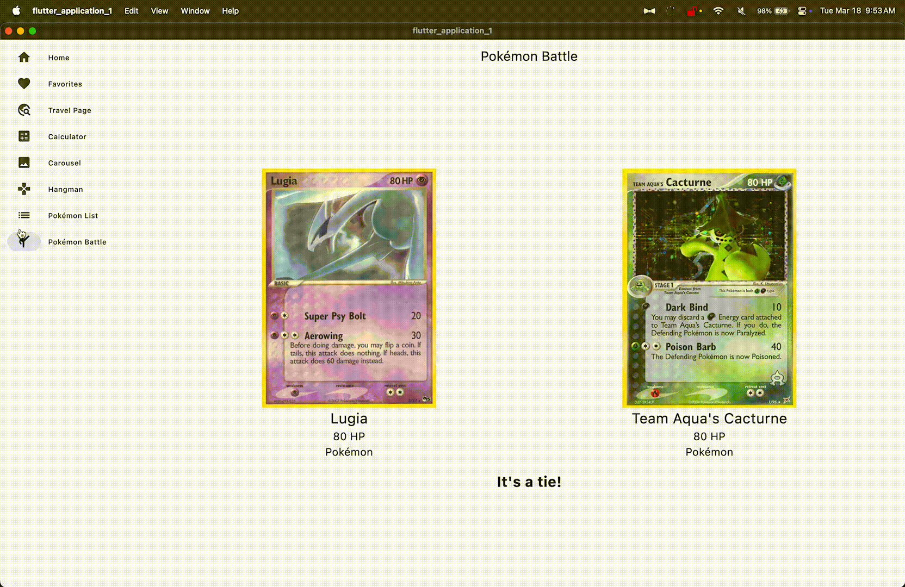

# Pokemon Battle 

## Overview

The Pokemon Battle feature allows users to engage in battles between different Pokemon. Users can select their Pokemon, choose moves, and compete against other Pokemon to win battles.

## Features
<>
- Select Pokemon from a list of available Pokemon.
- Choose moves for your Pokemon during battles.
- Battle against AI-controlled Pokemon.
- View battle results and statistics.

## Code Structure

The project is organized into several key components:

### 1. Models
The `models` directory contains the data models used in the application. These models represent the core entities such as Pokemon, Moves, and Battle.

### 2. Services
The `services` directory includes the logic that handle the core functionalities of the application, such as battle mechanics, move selection, and AI opponent logic.

### 3. UI
The `ui` directory contains the user interface components of the application. This includes screens, widgets, and other UI elements that the user interacts with.

### 4. Utils
The `utils` directory holds utility functions and helpers that are used throughout the application for various tasks such as data formatting and validation.

